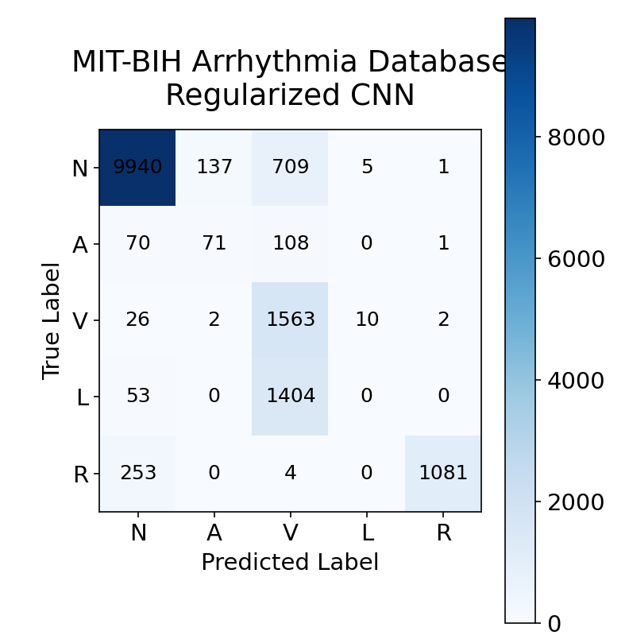
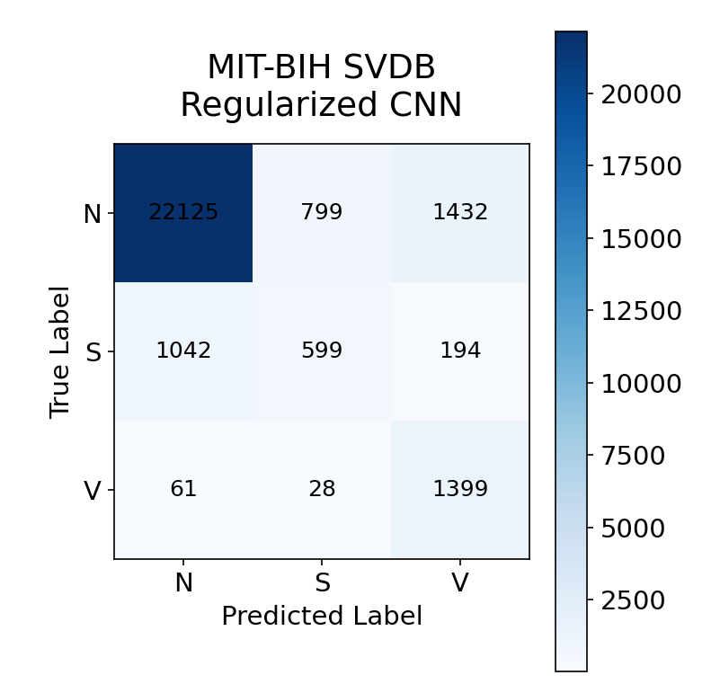

# ECG Cardiac Abnormality Detection using Deep Learning


An end-to-end deep learning project for automated ECG heartbeat classification using 1D Convolutional Neural Networks (CNNs) on the **MIT-BIH Arrhythmia Database** and **MIT-BIH Supraventricular Arrhythmia Database (SVDB)**.

The project implements a complete machine learning pipeline, including ECG preprocessing, heartbeat extraction, patient-wise dataset splitting, model development, evaluation, and comparative experimentation across multiple CNN architectures.

---

## Features

- Patient-independent heartbeat classification
- End-to-end ECG preprocessing pipeline
- Heartbeat extraction from annotated ECG recordings
- Patient-wise train/validation/test split to prevent data leakage
- Per-heartbeat Z-score normalization
- Multiple deep learning architectures
  - Baseline CNN
  - Regularized CNN
  - Deeper CNN
  - ResNet1D
- Class imbalance handling using weighted CrossEntropyLoss
- Early stopping and model checkpointing
- Comprehensive evaluation using:
  - Accuracy
  - Macro Precision
  - Macro Recall
  - Macro F1 Score
  - Per-class metrics
  - Confusion matrices
- Support for multiple PhysioNet ECG datasets

---

## Repository Structure

```text
ecg-cardiac-abnormality-detection/
│
├── README.md
├── LICENSE
├── .gitignore
│
├── assets/
│   ├── mitbih_confusion_matrix.png
│   └── svdb_confusion_matrix.png
│
└── ml/
    ├── src/
    │   ├── datasets/
    │   ├── models/
    │   ├── training/
    │   ├── config/
    │   ├── analysis/
    │   └── preprocessing/
    │
    ├── notebooks/
    ├── requirements.txt
    └── train.py
```

---

## Datasets

This repository contains experiments on two publicly available PhysioNet datasets.

### 1. MIT-BIH Arrhythmia Database

Primary heartbeat classification dataset consisting of 48 annotated ECG recordings sampled at **360 Hz**.

Five heartbeat classes were used:

| Class | Description |
|--------|-------------|
| N | Normal Beat |
| A | Atrial Premature Beat |
| V | Premature Ventricular Contraction |
| L | Left Bundle Branch Block Beat |
| R | Right Bundle Branch Block Beat |

---

### 2. MIT-BIH Supraventricular Arrhythmia Database (SVDB)

A second dataset used to evaluate model generalization on supraventricular arrhythmias.

Three heartbeat classes were used:

| Class | Description |
|--------|-------------|
| N | Normal Beat |
| S | Supraventricular Beat |
| V | Ventricular Beat |

---

## Data Processing Pipeline

Each ECG recording undergoes the following preprocessing steps before training.

```text
Raw ECG Record
        │
        ▼
Read ECG using WFDB
        │
        ▼
Read Beat Annotations
        │
        ▼
Heartbeat Extraction
(100 samples before R peak
150 samples after R peak)
        │
        ▼
Heartbeat Length = 250 Samples
        │
        ▼
Per-heartbeat Z-score Normalization
        │
        ▼
Patient-wise Train / Validation / Test Split
        │
        ▼
PyTorch Dataset
        │
        ▼
DataLoader
        │
        ▼
Deep Learning Model
        │
        ▼
Evaluation
```

---

## Model Architectures

Several architectures were implemented and compared throughout the project.

### Baseline CNN

- Conv1D
- ReLU
- MaxPool
- Conv1D
- ReLU
- MaxPool
- Fully Connected Layer
- Output Layer

---

### Regularized CNN

Improvements over the baseline include:

- Batch Normalization
- Dropout
- Weight Decay
- Early Stopping
- Model Checkpointing

---

### Deeper CNN

An extended CNN architecture with additional convolutional layers to improve feature extraction capacity.

---

### ResNet1D

Residual learning architecture adapted for one-dimensional ECG signals using skip connections to improve gradient flow and deeper feature learning.

---

## Training Strategy

To ensure realistic evaluation and avoid patient leakage:

- Patient-wise dataset splitting
- Weighted CrossEntropyLoss
- Adam optimizer
- Early stopping
- Best model checkpointing
- Validation after every epoch
- Macro F1 Score used for model selection

The best-performing model was selected using the highest validation Macro F1 score.

---

# Results

Models were evaluated using patient-independent validation splits to ensure that ECG recordings from the same patient never appeared in both the training and validation sets.

Primary evaluation metrics:

- Accuracy
- Macro Precision
- Macro Recall
- Macro F1 Score

---

## MIT-BIH Arrhythmia Database

### Model Comparison

| Model | Accuracy | Macro F1 |
|--------|---------:|---------:|
| Baseline CNN | 79.41% | 0.5255 |
| **Regularized CNN** | **81.96%** | **0.5443** |

The Regularized CNN improved upon the baseline through:

- Batch Normalization
- Dropout
- Weight Decay
- Early Stopping

The best model was obtained at **Epoch 7**.

### Best Validation Metrics

| Metric | Value |
|--------|------:|
| Accuracy | **81.96%** |
| Macro Precision | **0.5416** |
| Macro Recall | **0.5976** |
| Macro F1 | **0.5443** |

### Confusion Matrix

<p align="center">
    
</p>

The confusion matrix highlights the strengths and weaknesses of the model.

Observations:

- Excellent classification of **Normal (N)** beats.
- Strong performance on **Right Bundle Branch Block (R)** beats.
- High recall for **Ventricular (V)** beats.
- Frequent confusion between **Left Bundle Branch Block (L)** and **Ventricular (V)** beats, motivating further feature-space analysis.

---

## MIT-BIH Supraventricular Arrhythmia Database (SVDB)

### Model Comparison

| Model | Accuracy | Macro F1 |
|--------|---------:|---------:|
| ResNet1D | 78.55% | 0.5627 |
| Deeper CNN | 75.77% | 0.5249 |
| **Regularized CNN** | **87.15%** | **0.6391** |

The Regularized CNN achieved the best overall performance on the SVDB dataset.

### Best Validation Metrics

| Metric | Value |
|--------|------:|
| Accuracy | **87.15%** |
| Macro F1 | **0.6391** |

### Confusion Matrix

<p align="center">
    
</p>

Observations:

- Excellent recognition of **Normal** beats.
- Strong performance on **Ventricular** beats.
- Most remaining errors occur between **Normal** and **Supraventricular** beats due to waveform similarity.

---

# Experimental Summary

Across both datasets, several CNN architectures were explored to study the effect of architectural improvements on ECG heartbeat classification.

| Dataset | Best Model | Macro F1 |
|---------|------------|---------:|
| MIT-BIH Arrhythmia | Regularized CNN | **0.5443** |
| MIT-BIH SVDB | Regularized CNN | **0.6391** |

The experiments demonstrate that relatively lightweight one-dimensional CNN architectures can achieve competitive heartbeat classification performance when combined with careful preprocessing, patient-wise data splitting, and appropriate regularization techniques.

---

# Repository Branches

This repository contains experiments on two different ECG datasets.

| Branch | Description |
|--------|-------------|
| **main** | MIT-BIH Arrhythmia Database experiments |
| **svdb-experiments** | MIT-BIH Supraventricular Arrhythmia Database experiments |

Keeping the datasets on separate branches preserves a clean project history while allowing independent experimentation.

---

# Installation

## Clone the repository

```bash
git clone https://github.com/<your-username>/ecg-cardiac-abnormality-detection.git

cd ecg-cardiac-abnormality-detection
```

---

## Create a virtual environment

Windows

```bash
python -m venv .venv
.venv\Scripts\activate
```

Linux / macOS

```bash
python3 -m venv .venv
source .venv/bin/activate
```

---

## Install dependencies

```bash
pip install -r ml/requirements.txt
```

---

# Dataset Setup

This project uses publicly available ECG datasets from **PhysioNet**.

Download the desired dataset:

- MIT-BIH Arrhythmia Database
- MIT-BIH Supraventricular Arrhythmia Database (SVDB)

Place the extracted files inside the project's raw data directory.

Example:

```text
ml/
└── data/
    └── raw/
        ├── mit-bih-arrhythmia-database-1.0.0/
        └── mit-bih-supraventricular-arrhythmia-database-1.0.0/
```

> The datasets are **not included** in this repository because of their size and licensing.

---

# Training

Run training using

```bash
cd ml

python -m src.training.train
```

The training pipeline automatically performs:

- Dataset loading
- Heartbeat extraction
- Signal normalization
- Patient-wise dataset splitting
- Model training
- Validation after every epoch
- Early stopping
- Best model checkpointing

---

# Technologies Used

- Python
- PyTorch
- NumPy
- SciPy
- scikit-learn
- WFDB
- Matplotlib

---

# Project Highlights

This project demonstrates experience with:

- Biomedical signal processing
- Time-series deep learning
- One-dimensional CNN design
- ECG heartbeat segmentation
- Medical dataset preprocessing
- Patient-independent evaluation
- Class imbalance handling
- Model regularization
- Failure analysis using confusion matrices
- Comparative experimentation across multiple CNN architectures

---

# Future Improvements

Potential future work includes:

- Transformer-based architectures for ECG classification
- Multi-lead ECG support
- Data augmentation techniques
- Hyperparameter optimization
- Explainable AI methods (e.g., Grad-CAM for 1D CNNs)
- Cross-dataset generalization studies
- Real-time ECG inference pipeline

---

# References

1. Moody, G. B., & Mark, R. G. (2001). *The Impact of the MIT-BIH Arrhythmia Database*. IEEE Engineering in Medicine and Biology Magazine.

2. Goldberger, A. L., et al. (2000). *PhysioBank, PhysioToolkit, and PhysioNet: Components of a New Research Resource for Complex Physiologic Signals.*

3. PhysioNet

https://physionet.org/

4. WFDB Python Package

https://wfdb.readthedocs.io/

---

# License

This project is licensed under the MIT License.

See the `LICENSE` file for details.

---

# Acknowledgements

This project was developed as part of a personal deep learning portfolio to explore biomedical signal processing, ECG heartbeat classification, and patient-independent evaluation using real-world clinical datasets.

Special thanks to the PhysioNet team for making high-quality annotated ECG datasets publicly available for research and education.
